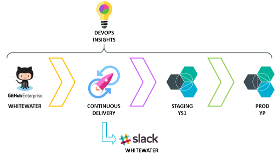

#  Get started with Docker/Kubernetes and IBM Whitewater - deprecated
## use https://github.com/open-toolchain/secure-kube-toolchain instead and select Github Enterprise Whitewater as the source provider

### Continuously deliver a Docker app with IBM Whitewater GHE and Kubernetes

This template will configure a toolchain that can:
* build a Docker image from app source code, and secure it using Vulnerability Advisor
* orchestrate a Docker image deployments through a staging Kubernetes cluster and a production Kubernetes cluster (using distinct namespaces to allow sharing same cluster)
* provide cognitive insights to learn where you most need to improve your developer productivity, code quality, and delivery cycle times; as well as provide quality gates that will stop a deploy that doesn’t cut the mustard.
* track code deployments back to GHE commits and issues --- TBD
* notify about delivery process in Slack
* allows to edit code online with WebIDE (but you can use desktop tools at your preference)

### To get started, click **Create toolchain**.

---
### Learn more

* About this [toolchain capabilities](https://w3-connections.ibm.com/blogs/92423b28-353a-49d9-9d5d-d21cd1de10be/entry/Announcing_support_for_IBM_Confidential_toolchains_in_the_Continuous_Delivery_service_on_Bluemix_Public?lang=en_us)
* Learn about [Whitewater](https://whitewater.ibm.com)
* Getting started with [Bluemix DevOps](https://bluemix.net/devops)
* [Documentation](https://console.bluemix.net/docs/services/ContinuousDelivery/index.html?pos=2)
* [Toolchains on the Bluemix Garage Method site](https://www.ibm.com/devops/method/category/tools)
* Blog: [Bluemix Continuous Delivery is now live](https://www.ibm.com/blogs/bluemix/2016/11/bluemix-continuous-delivery-is-now-live/)
* Video: [Introducing IBM Bluemix Continuous Delivery](https://www.youtube.com/watch?v=QPSAZ64APpc&feature=youtu.be) (2m12s)
